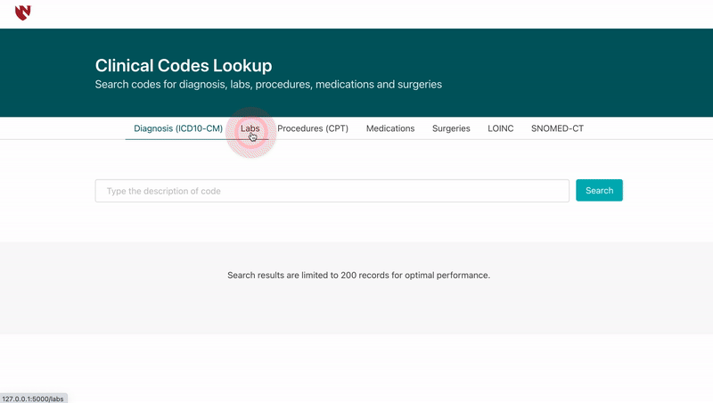

# Clinical Codes Lookup (CCL)

Source code repository for Clinical Codes Lookup tool.

The clinical Codes Lookup tool is an efficient search engine and aids the researchers at the University of Nebraska Medical Center (UNMC) to browse various custom coding systems used within the EHR (Electronic Health Record) system and also globally used coding systems such as ICD-10-CM (International Classification of Diseases, Tenth Revision, Clinical Modification), LOINC (Logical Observation Identifiers Names and Codes) and SNOMED-CT (Systematized Nomenclature of Medicine - Clinical Terms)




## Features
- Allows searching on Diagnosis, Medications, Procedures, Lab Results, and Surgery codes.
- Allows typo tolerant fuzzy search
- Blazing fast search (across millions of records)
- Allows downloading the search results.
- Displays the access time and number of records matched the search

## Technology Stack
1. [Python Flask](https://flask.palletsprojects.com/en/1.1.x/quickstart/#quickstart) (Web Development)
2. [MariaDB](https://mariadb.org/) (Database)
3. [Meilisearch API](https://docs.meilisearch.com/) (Indexing the records)
3. [Bulma CSS Framework](https://bulma.io/documentation/) (User Interface Development)

## Installation

### MariaDB Setup
#### macOS (brew package manager)

```bash
# Install MariaDB
brew install mariadb

# Start the instance
mysql.server start

# Connect to the server
mysql

# Create Database
CREATE database clinical_codes;
```
Additional configurations and installations on other operating systems can be found on the [MariaDB](https://mariadb.com/kb/en/getting-installing-and-upgrading-mariadb/) website

#### Load the csv files into MariaDB database
- Update the paths in sql_scripts/create_tables_load_data.sql with the absolute paths of csv files

```bash
mysql clinical_codes < sql_scripts/create_tables_load_data.sql 
```
- Validate the counts in the table with record counts in individual files

```sql
SELECT COUNT(*) AS COUNT, 'SNOMEDCT' AS CODE_TYPE FROM SNOMEDCT_CODES
UNION
SELECT COUNT(*) AS COUNT, 'LOINC' AS CODE_TYPE FROM LOINC_CODES
UNION
SELECT COUNT(*) AS COUNT, 'DIAGNOSIS' AS CODE_TYPE FROM DIAGNOSIS_CODES
UNION
SELECT COUNT(*) AS COUNT, 'LAB' AS CODE_TYPE FROM LAB_CODES
UNION
SELECT COUNT(*) AS COUNT, 'PROCEDURE' AS CODE_TYPE FROM PROCEDURE_CODES
UNION
SELECT COUNT(*) AS COUNT, 'SURGERY' AS CODE_TYPE FROM SURGERY_CODES;
```

### Meilisearch Setup
#### macOS (brew package manager)

```bash
# Install meilisearch
brew install meilisearch

# Launch MeiliSearch with a max payload of 600MB (taken in bytes)
meilisearch --http-payload-size-limit '629145600'
```
Additional configurations and installations on other operating systems can be found on the [Meiliserach](https://docs.meilisearch.com/learn/getting_started/installation.html#download-and-launch) website.

### Application Setup

```bash
# Install required python modules using python package manager
pip3 install Flask Flask-Excel mysqlclient meilisearch

# Set the global variable FLASK_APP to app.py file
export FLASK_APP=app.py

# Run the flask app in development mode
flask run
``` 

## License

This repository contains the source code for the open-source version of the Clinical Codes Lookup tool, released under the GPL V2 license.

See [LICENSE-GPLv2.md](LICENSE-GPLv2.md) for more details.